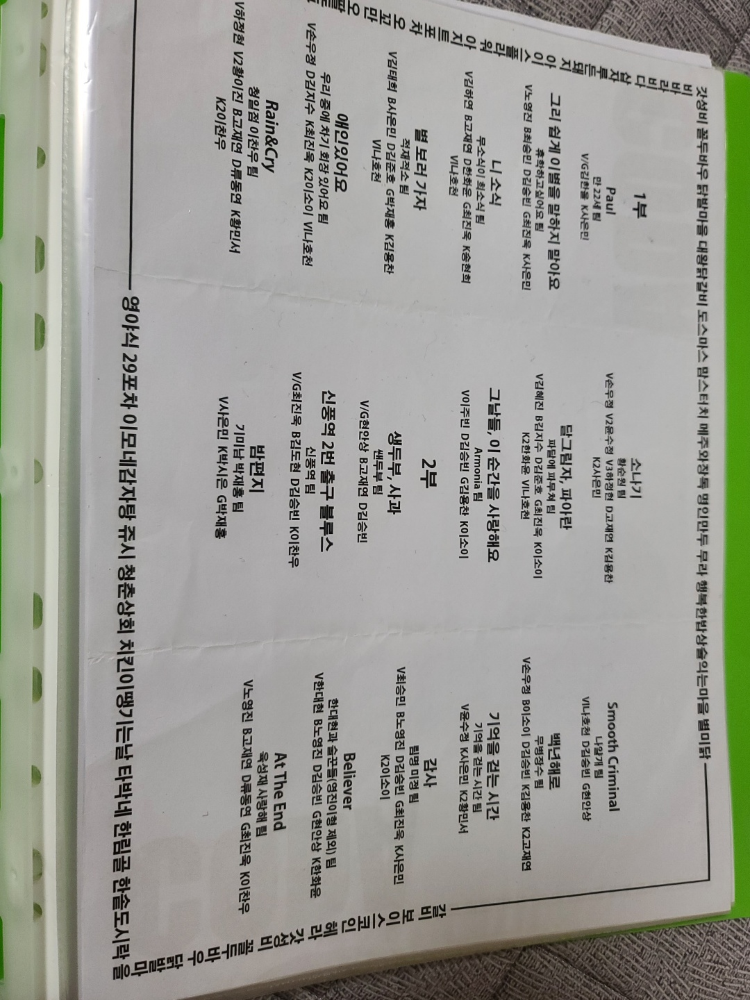

# 한림대학교 빅데이터 전공 이찬우
---
## 🔎 더 알아보기

🎓전공 : 빅데이터 학과 
📕학년 : 2학년 
🎵취미 : 피아노 연주   

----
# 📌동아리활동

## 중앙동아리 : 코다(coda), 아이덴티티(identity)

### 🎹코다
* 2019년 코다 키보드파트 지원
* 2019년 코다 정기공연
 

### 🎲아이덴티티

## 학과동아리 : 씨애랑

### 📝씨애랑

📢
⛳
